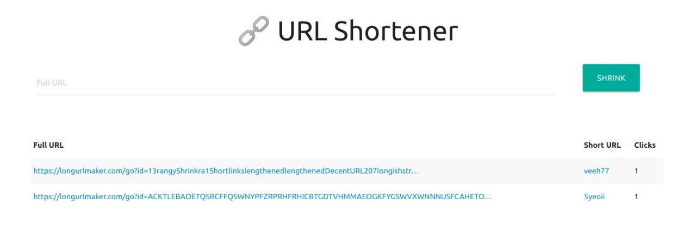

URL Shortener
==============

How it works
------------

It shrinks URLs and stores how many times the short URL it was clicked.

### Screenshots

Installing & Running
--------------------

You can install `url-shortener` cloning it from GitHub:

        $ git clone https://github.com/xavierigor/url-shortener
        
> Afterwards, you'll have to create a .env file in the root of the project, copy the contents of .env.example to it and modify `SECRET_KEY` and `DATABASE_URL` with your own database and secret key.

Use `make setup` to activate virtualenv shell, install project's dependencies and run migrations:

        $ cd project-name/
        $ make setup

Now you can run all tests:

        $ make test

And run the Django built-in server:

        $ make run
        

Contributing
--------------------
1. Fork and clone the project
2. Create a new branch from `master` with the name of the new feature, eg: `my-new-feature`
3. Commit your changes to the new branch
4. Make a Pull Request

License
--------------------
This project is licensed under the [MIT](LICENSE) license.
